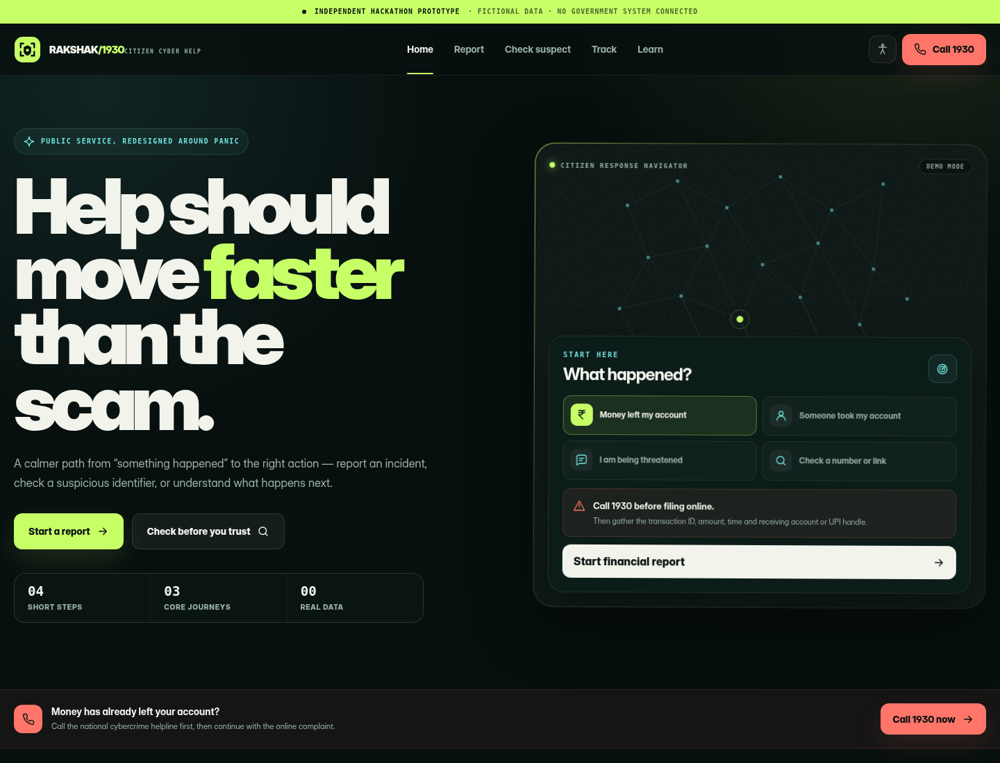

# RAKSHAK

A citizen-first redesign of India’s cybercrime reporting experience, built as an **independent hackathon prototype** with React, TypeScript and Tailwind CSS.



The concept begins with the moment a citizen is actually in: confused, anxious and unsure which portal category to choose. Instead of exposing the information architecture first, Rakshak asks **“What happened?”**, surfaces the urgent action, and moves the person into one of three clear outcomes:

1. Report an incident.
2. Check a suspicious identifier.
3. Track what happens next.

> This project does not use official branding, live government APIs or real complaint data. Every record and identifier is synthetic and stored only in the browser.

## What is implemented

| Journey | Working behaviour |
|---|---|
| Home / response navigator | Interactive incident triage, urgent 1930 escalation, clear route selection and responsive layout |
| Report cybercrime | Four-step form, incident categories, women/child anonymous option, contextual financial-fraud warning, validation, local autosave, evidence-name handling, review, consent and acknowledgement generation |
| Check suspect | Phone, UPI ID, email and URL validation; synthetic repository lookup; high/caution/no-match results; signal explanations and next actions |
| Track complaint | Search by demo reference, locally created cases, progress ring, assigned unit, plain-language status timeline and downloadable text status |
| Learning corner | Searchable/filterable situation playbooks, emergency actions, expandable guidance and an interactive scam-signal checklist |
| Accessibility | Keyboard focus states, larger-text mode, reduced-motion mode, mobile-first controls and a persistent mobile 1930 action |

## Reviewer demo — under 60 seconds

### Fastest complete path

1. Open **Report**.
2. Choose **Money or payment fraud**.
3. Continue and click **Use demo details**.
4. Continue and click **Add demo evidence**.
5. Continue; enter:
   - Name: `Aarav Demo`
   - Mobile: `9000001930`
6. Confirm the synthetic-data notice and create the demo complaint.
7. Open **Track this demo case** to see the locally generated timeline.

### Ready-made test values

| Feature | Demo value |
|---|---|
| Track case | `RK-DEMO-26-84019` |
| Flagged phone | `9876543210` |
| Flagged UPI ID | `refunddesk@upi` |
| Caution email | `support-kys@example.com` |
| Flagged URL | `https://secure-update.example` |

## Run locally

Requirements: a current Node.js LTS release and npm.

```bash
npm install
npm run dev
```

Then open the local Vite URL shown in the terminal.

Production build:

```bash
npm run build
npm run preview
```

## Instant no-install preview

`preview.html` is a dependency-free visual preview of the homepage direction. It includes the interactive response navigator and can be opened directly in a browser. It is not a substitute for the React application; the complete workflows live in `src/`.

- Desktop capture: `preview-desktop.png`
- Mobile capture: `preview-mobile.png`

## Technical stack

- React 19 + TypeScript
- React Router
- Tailwind CSS 3.4
- Framer Motion
- Lucide icons
- Fontsource variable fonts
- Browser `localStorage` for synthetic drafts and cases

## Project structure

```text
src/
├── components/
│   ├── AccessibilityMenu.tsx
│   ├── BrandMark.tsx
│   ├── Button.tsx
│   ├── Footer.tsx
│   ├── Layout.tsx
│   ├── Navigation.tsx
│   ├── PageIntro.tsx
│   ├── PrototypeBar.tsx
│   └── SectionLabel.tsx
├── data/content.ts
├── lib/
│   ├── cx.ts
│   └── storage.ts
├── pages/
│   ├── CheckPage.tsx
│   ├── HomePage.tsx
│   ├── LearnPage.tsx
│   ├── ReportPage.tsx
│   └── TrackPage.tsx
├── App.tsx
├── index.css
├── main.tsx
└── types.ts
```

## Product decisions

### 1. Triage before navigation

A citizen should not need to understand police categories while under stress. The homepage starts from familiar situations such as “Money left my account” or “Someone took my account,” then gives the immediate instruction and correct route.

### 2. One urgent action

Financial fraud is treated differently because speed matters. The 1930 call action appears in context, in the navigation, in financial-report screens and as a persistent mobile action without making every screen feel alarming.

### 3. Human-language status

The tracking experience avoids opaque internal codes. It shows what is completed, the active stage, who currently owns the case and what the citizen should expect next.

### 4. Premium, not decorative

The visual hook is an “incident command centre”: dark civic calm, signal-lime priority states, restrained scanning motion, editorial typography and a custom network field. Motion and contrast always support hierarchy rather than adding spectacle for its own sake.

### 5. Honest prototype boundary

The independent-prototype disclosure is persistent. No official logo is copied. All IDs, complaint counts, people, domains and case events are fictional. File contents are never uploaded; only file names are stored in the local draft.

## Existing-service coverage

The prototype retains the portal’s primary citizen-facing services while simplifying their presentation:

- Financial-fraud complaint route and 1930 escalation
- Other cybercrime reporting
- Women/child sensitive and anonymous reporting route
- Complaint tracking
- Suspect repository checks for phone, UPI, email and website
- Suspicious-identifier reporting handoff
- Cyber-safety learning content

Volunteer and law-enforcement-only workflows are intentionally outside this citizen MVP.

## Production integration boundaries

A real deployment would need approved, audited integrations for:

- Citizen authentication and OTP verification
- Secure evidence upload, malware scanning and retention
- NCRP/police case creation and status events
- Jurisdiction routing
- Bank/payment-provider escalation
- Notification delivery
- Multilingual content governance
- Accessibility and security audits

The UI deliberately labels simulated outcomes instead of pretending these integrations exist.

## Deployment

The app is compatible with Vercel, Netlify and other static hosts. SPA fallback files are included:

- `vercel.json`
- `public/_redirects`

For any static host, route all unknown paths to `index.html`.

## Codex documentation

Use `CODEX_WORKLOG_TEMPLATE.md` to record your team’s **actual** Codex sessions, human review decisions and verification commands. The template is intentionally blank so the submission does not fabricate process evidence.

## Validation note

The source was parsed and TypeScript-checked with temporary local dependency shims, and both desktop and mobile visual previews were rendered in Chromium. The build environment used to create this package could not reach the npm registry, so run `npm install && npm run build` on a connected machine before submission.

## License

MIT. See `LICENSE`.
